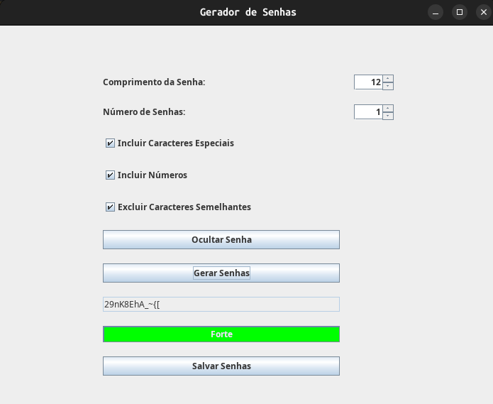

# 🔐 Gerador de Senhas

    

**Status:** 🚧 Em Desenvolvimento

Essa aplicação permite a geração de senhas. O projeto oferece funcionalidades para ajustar o comprimento da senha, incluir caracteres especiais e números, além de excluir caracteres semelhantes. As senhas geradas são armazenadas em um histórico e podem ser salvas criptografadas.

## 🔧 Tecnologias Utilizadas

- **Java** para a implementação da aplicação
- **Java Swing** para a interface gráfica do usuário
- **Java Cryptography** para criptografar senhas
- **SecureRandom** para geração de senhas aleatórias

## 📌 Funcionalidades Atuais

✔️ Geração de senhas personalizáveis  
✔️ Exclusão de caracteres semelhantes  
✔️ Avaliação da força da senha gerada  
✔️ Histórico de senhas geradas  
✔️ Salvar senhas em arquivo criptografado  

## 🚀 Funcionalidades em Desenvolvimento

🔹 Melhorias na interface do usuário  
🔹 Opções avançadas de configuração de senhas  
🔹 Suporte a diferentes métodos de criptografia  
🔹 Implementação de um sistema de autenticação  

